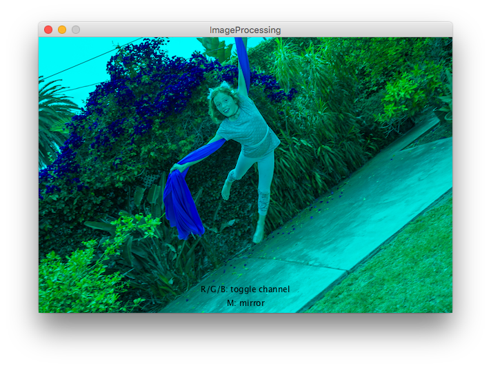
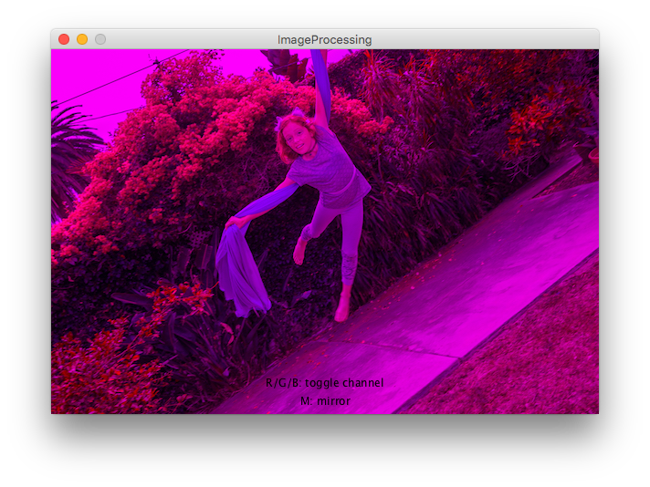
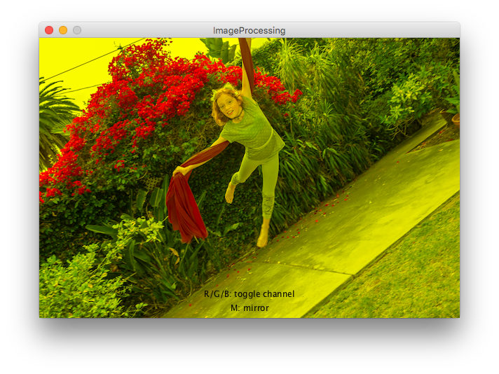
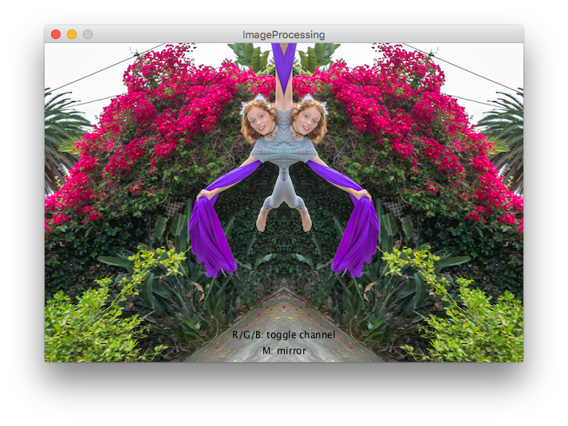

This is a set of short Java code examples that use the Processing libraries.

These examples may be useful to computer science educators who are teaching a
course with the Java language (e.g. AP Computer Science A).  Processing
provides an easy entry point to computer graphics programming.  The Processing
libraries are open source and can be used directly from Java programs.

Computer graphics applications are a natural place to use object oriented
programming techniques.  In addition, concepts such as 2D arrays and recursion
can be illustrated nicely with computer graphics.


## Install software

[Processing](https://processing.org/)  (_Pay attention to where you install it!_)  

[Java Development Kit JDK SE 8](https://www.oracle.com/technetwork/java/javaee/downloads/jdk8-downloads-2133151.html)  

[Text editor](https://atom.io/) or Integrated Development Environment (IDE).  


## Set the CLASSPATH environment variable

This is the most important part, and the biggest headache:  
[Setting the CLASSPATH environment variable](classpath)

Assuming you've set your `CLASSPATH` environment variable correctly, you can
run all the examples on the command line:
```
javac HelloProcessing.java
java HelloProcessing
```

## Processing and the `PApplet` class

Here's the red pill.  When you run a Processing sketch, all of your global
stuff (variables, functions like `setup()`, `draw()`, `keyPressed()`, etc.)
gets embedded in a class, and that class is a subclass of `PApplet`.  The
`PApplet` class contains all the Processing functions that you are familiar
with, like `size()` and `ellipse()`.

[HelloProcessing.java](HelloProcessing.java)

<script src="processing.min.js"></script>
<canvas data-processing-sources="HelloProcessing/HelloProcessing.pde"></canvas>

Some things to note:

* There is a `settings()` method, which is where `size()` (or `fullScreen()`)
  must be called.  The `settings()` function is called before `setup()`.
* The `PApplet` class has a static `main()` function that you call with the
  name of your class.

## Using external classes

You can write your own Java classes, but you need to give them a reference to
the main `PApplet` class so that it can call the Processing drawing functions.

[HelloProcessing2.java](HelloProcessing2.java)  
[Ball.java](Ball.java)

<canvas data-processing-sources="HelloProcessing2/HelloProcessing2.pde HelloProcessing2/Ball.java"></canvas>

## Applications

Object oriented programming techniques are very useful in computer graphics
programming, e.g. the `Ball` class in the `HelloProcessing2` example.  Here are
some other ideas for illustrating concepts from AP Computer Science A with the
Processing libraries.

__2D array application: Image Processing__

[ImageProcessing.java](ImageProcessing.java)

 
 
 
 

__Recursion application: Fractals__

[Snowflake.java](Snowflake.java)

<canvas data-processing-sources="Snowflake/Snowflake.pde"></canvas>


## More info

These code examples are licensed under the [GPL v2.0](license), which means you are free
to copy and use the code, but if you distribute a modified program, you must
also distribute your code.   

You can download all the code examples from the Github repository:  
[https://github.com/dkessner/ProcessingLibraryExamples](https://github.com/dkessner/ProcessingLibraryExamples)

Dr. Darren Kessner  
[Darren.Kessner@marlborough.org](mailto:Darren.Kessner@marlborough.org)  
[STEM+ Program](http://stem.marlborough.org)  
[Marlborough School, Los Angeles](http://marlborough.org)  


